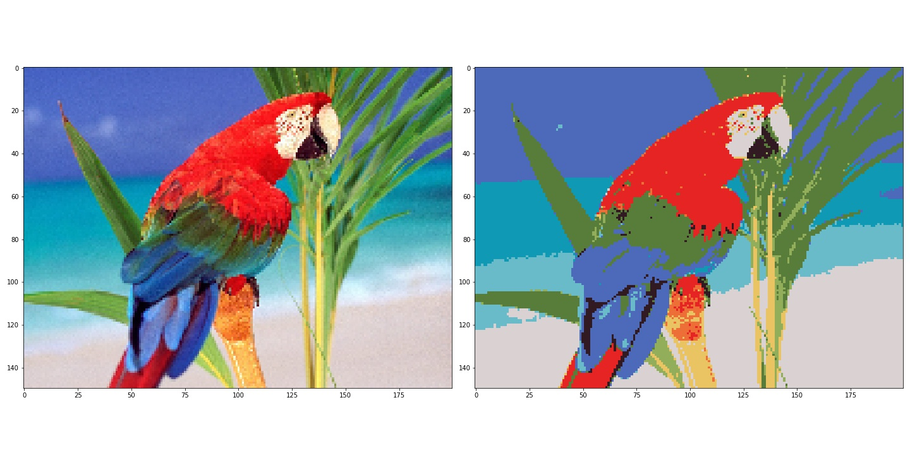
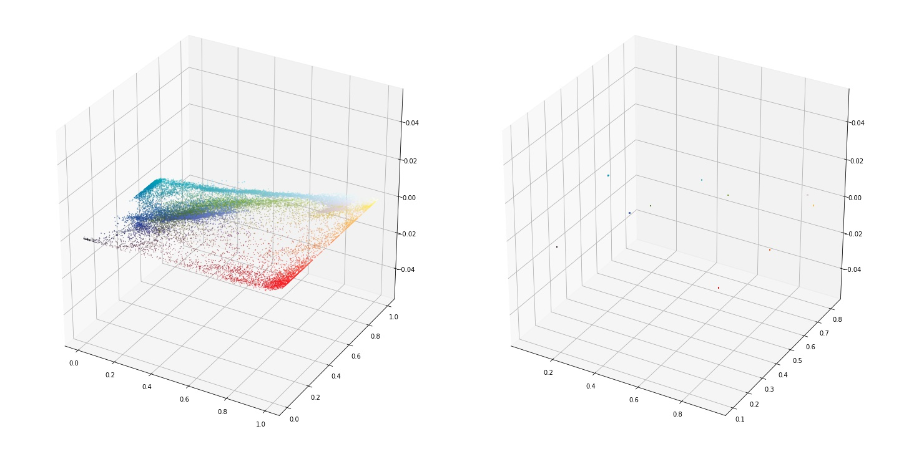

# Mean Shift Segmentation

This is a basic implementation on the Mean Shift Algorithm in Python3.

## Results

Here is a GIF visualizing the change in pixel intensities over time for 25 iterations.

  

The final results
 

  
  

